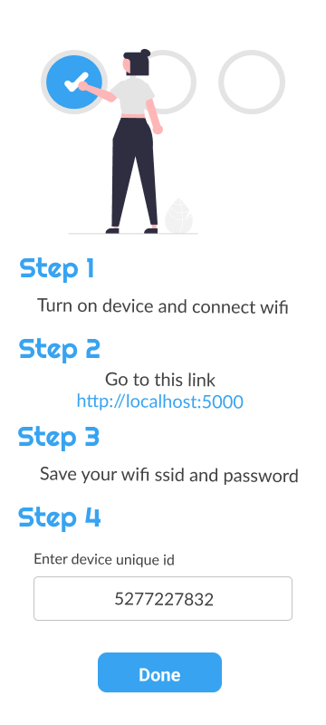
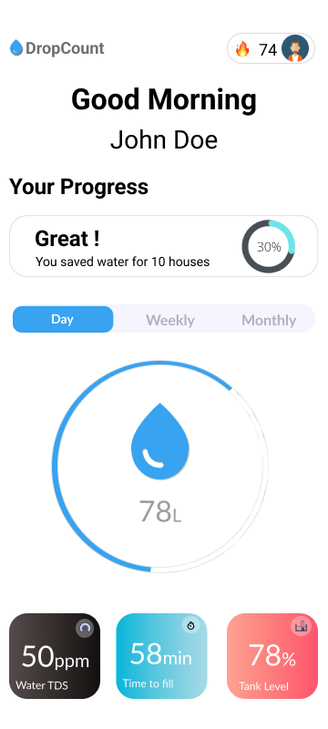
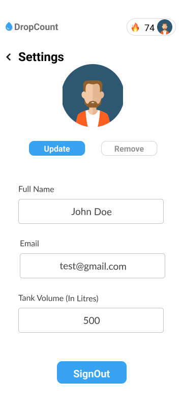

# DropCount

<p align="center">
    
  </a>


## Table of contents

- [Overview](#overview)
- [Build and run](#build-and-run)
- [Instaling](#installing)
- [Screenshots](#screenshots)


## Overview

Water Usage Detector: This device consists of a water flow sensor and nodemcu. It is connected with firebase to send data directly to the database, from where the data is fetched by our app displays the water usage. It would be installed at the water tank outlet and when water is passed through it Water Flow Sensor will get record the readings and through Nodemcu it directly sends data to the firebase.

      
## Build and run
* Assuming this is your first project, install [flutter](https://flutter.dev/docs/get-started/install)
* Clone this project using the url or ssh and cd into the cloned directory
* Get the dependencies with ``` flutter pub get ```
* Run the app in debug mode with ``` flutter run ```

## Installing

Add the following to your `pubspec.yaml` file:

    dependencies:
      google_fonts: ^2.2.0
      url_launcher: ^6.0.18
      firebase_core: ^1.13.1
      firebase_auth: ^3.3.11
      google_sign_in: ^5.2.4
      cupertino_icons: ^1.0.2
      font_awesome_flutter: ^10.0.0
      provider: ^6.0.2
      percent_indicator: ^4.0.0
      awesome_dropdown: ^0.0.4
      firebase_database: ^9.0.8
      firebase_database_web: ^0.2.0+7
      http: ^0.13.4
      intl: ^0.17.0
      
## Screenshots

||||||
|---|---|---|---|---|


#### MIT LICENCE
